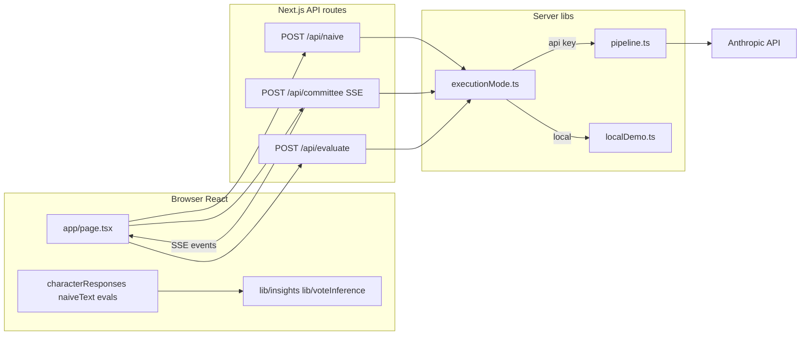

# Session Handoff: 2026-05-11 — Technical workings and algorithmic inspirations for the Cyberneutics interactive demo

## Session Summary

**Duration:** Single focused request (implementation of planned successor-facing doc).

**Primary deliverable:** This handoff — an **engine-room companion** for the Next.js app in `demo/`. It is written so a successor (Claude or human) can produce a **technical talk** or deep walkthrough: architecture, data flow, what is model-generated vs. heuristic, and where classical theorems motivate UI without being claims about the live pipeline.

**Relationship to prior handoff:** The slide-first, audience-priming blueprint (`Talk slides that prime an audience…`) now lives at **`agent/archive/handoff-2026-05-10.md`**. Use that archive for **deck structure, misconceptions, learning objectives, and live-demo bridge script**. Use **this** document for **routes, SSE, pipeline phases, inference code, Condorcet math vs. committee reality, observability panels, and longitudinal metrics**.

**Original intent vs. outcome:** Produce one place that holds enough **accurate, file-anchored** detail to narrate technical workings and algorithmic inspirations without re-reading the whole tree.

---

## Mistakes and Lessons (for technical narrators)

- **Avoid:** Saying `buildCondorcetShift` compares “round 1 vs round 2.” It compares **inferred votes** from `phase1` text vs **`phase2` text**. On the client, **every committee phase ≥ 2 appends to the same `phase2` string** (`demo/app/page.tsx`, `character_chunk` handler: `target = phaseLocal >= 2 ? "phase2" : "phase1"`). So `phase2` can contain **cross-examination plus all follow-up rounds** concatenated. The transcript builder still labels that block “Round 2” for the evaluator (`buildTranscript`) — a **labeling simplification**, not “only phase 2 of the server.”
- **Avoid:** Implying the **Condorcet jury explorer** validates the adversarial committee. The artifact **`artifacts/condorcet-jury-theorem-and-committee.md`** states explicitly: the committee **does not** satisfy Condorcet’s independence conditions; the explorer is a **ballot lab / intuition pump** (classical homogeneous jury + Monte Carlo batch) beside the deliberation UI.
- **Avoid:** Treating **metacognition counts** as NLP understanding. They are **per-role regex hit counts** on transcript text (`demo/lib/insights.ts` `METACOGNITION_PATTERNS`), useful as a **coarse observability probe**, not semantic analysis.
- **Avoid:** Forgetting **execution mode** when discussing batch variance. `local` ⇒ deterministic scripted/heuristic behavior; `api` ⇒ live stochastic runs. Same UI code paths, different ground truth.

---

## Dead Ends Explored

- None this session (documentation-only).

---

## Current State

### Completed This Session

- Archived `agent/handoff-2026-05-10.md` → `agent/archive/handoff-2026-05-10.md`.
- Authored this active handoff `agent/handoff-2026-05-11.md`.

### In Progress

- None.

### Not Yet Started

- Optional: sync `demo/README.md` glossary with newer observability panels if mg wants README parity with UI density.

---

## Immediate Next Steps

1. When building a talk, pick **audience** (exec / engineer / mixed) and choose a **talk arc** from §Suggested technical talk arcs.
2. Fact-check **model id** before recording: search `MODEL` in `demo/lib/pipeline.ts`, `demo/app/api/naive/route.ts`, `demo/app/api/evaluate/route.ts` (currently **`claude-sonnet-4-5`** in tree at handoff time).
3. For **slide-first** pedagogy, pull misconceptions and slide outlines from **`agent/archive/handoff-2026-05-10.md`** rather than duplicating here.

---

## Working with mg: Session-Specific Insights

- mg values **honest epistemic framing**: distinguish illustration, heuristic, and theorem-qualified claims — especially around Condorcet and rubric scores.
- **Execution-ready** pointers: file paths and one-line “what breaks if you misdescribe this.”

---

## Open Questions and Decisions Needed

1. **Talk length** and whether **Q&A** assumes audience has the repo cloned (affects how deep to go on SSE and localStorage).
2. Whether to demo **adaptive depth** loop (undetermined majority ⇒ extra rounds up to 6) live — it matters for `phase2` accumulation story.
3. Whether to show **Monte Carlo batch** in `CondorcetJuryExplorer` on stage (visually strong; takes wall-clock).

---

## Technical Notes — Architecture (end-to-end)

### High-level flow

- **API keys** stay server-side (`demo/.env.local`). Browser never holds the key.
- **Committee** streams **typed JSON events** over SSE (`text/event-stream`). Client buffers by `\n\n`, parses lines starting with `data: `, `JSON.parse` into `CommitteeEvent` (`demo/lib/types.ts`).

### Execution modes

Source: `demo/lib/executionMode.ts`, `demo/README.md`.

| Mode   | Behavior |
|--------|----------|
| `auto` | Local demo if no `ANTHROPIC_API_KEY` **or** `LOCAL_DEMO_ONLY=1`; else API. |
| `local`| Always in-repo deterministic / heuristic paths. |
| `api`  | Requires key; throws if missing. |

### Routes (three POSTs)

| Route | File | Role |
|-------|------|------|
| Naive | `demo/app/api/naive/route.ts` | Single completion stream (API) or template (`localDemo`). |
| Committee | `demo/app/api/committee/route.ts` | SSE stream; delegates to `runCommitteePipeline` (`demo/lib/pipeline.ts`). |
| Evaluate | `demo/app/api/evaluate/route.ts` | JSON `EvaluationResult`; local heuristic vs. one Claude JSON call. |

### Committee pipeline (`runCommitteePipeline`)

Source: `demo/lib/pipeline.ts`.

- **Model constant:** `MODEL = "claude-sonnet-4-5"` (keep aligned with naive/evaluate routes).
- **Round count:** `totalRounds = clamp(options?.rounds ?? 2, 2, 6)` — **minimum 2**, **maximum 6**.
- **Local path:** Phase 1 scripted per character (`buildLocalCommitteeRound1`); phase 2 scripted (`buildLocalCommitteeRound2`); if `totalRounds > 2`, phases 3..N append **synthetic** refinement text driven by `inferVote` on prior text (deterministic vote commitment in template).
- **API path:** Parallel **research** per character (`runCharacterResearch`, `demo/lib/research.ts`) → round 1 prompts with research (`buildRoundOnePromptWithResearch`) → round 2 **cross-examination** with shared round-1 transcript (`buildCrossExaminationPrompt`) → rounds 3..N **follow-up** (`buildFollowupDeliberationPrompt`) with accumulated context (`buildPhaseContext`).
- **Return shape:** Local returns `{ rounds: [roundOne, roundTwo] }` after mutating round-two strings for extra local phases; API returns `{ rounds }` with one map per phase.

### Client state mapping (critical for talks)

Source: `demo/app/page.tsx` (`runCommittee`).

- On `character_chunk`, accumulated text goes to **`phase1` if current phase is 1**, else **`phase2`**.
- Therefore **all content from server phases 2 through N ends up in the same `phase2` field** per character. `buildCondorcetShift` compares votes inferred from **`phase1` vs `phase2`** — operationally “before vs after first-phase content,” where “after” includes **everything** merged into `phase2`.
- **`buildTranscript`** (same file) formats evaluation input as “Round 1” / “Round 2” per character using those two fields; with 3+ API rounds, the “Round 2” block is **not** only cross-examination — it is the **concatenated remainder**.

### Naive path

- Streams text chunks to the page (same reader loop pattern as committee but plain body stream for naive).
- Prompts: `demo/lib/prompts.ts`.

### Evaluation

- **Types:** `EvaluationResult` in `demo/lib/types.ts` — five rubric keys + `average` + `tier` (`STRONG` | `ADEQUATE` | `WEAK`) + `key_finding`.
- **Local:** `buildLocalEvaluation` in `demo/lib/localDemo.ts` — fixed-shape, deterministic.
- **API:** evaluator system path in evaluate route; model must return parseable JSON.

### Persistence

- **Run history / snapshots:** `demo/lib/runMemory.ts` → `localStorage` key `cyberneutics:run-memory:v2` (migrates v1 if present).
- **Decision accountability:** `demo/lib/decisionMemory.ts` (concerns, dispositions, overrides) — also browser-local.

---

## Heuristic and algorithmic layer (not the LLM)

### 1. Vote inference (`demo/lib/voteInference.ts`)

- **Declared vote:** Regexes on explicit lines like `Current vote: Aye`, `I vote nay`, etc.
- **Fallback:** Counts aye-leaning vs nay-leaning keyword families; requires margin ≥ 1; tie ⇒ `Undetermined`.
- **`inferMajority`:** Majority of five `VoteLabel`s; 2–2 split or all undetermined patterns yield `Undetermined` per implementation.
- **Used by:** `buildCondorcetShift`; local multi-round synthetic text in `pipeline.ts`; snapshots (`majorityBefore` / `majorityAfter`).

### 2. “Condorcet shift” diagnostics (`buildCondorcetShift` in `demo/lib/insights.ts`)

- Builds per-character row: inferred vote + source (`declared` | `fallback`) for **phase1** and **phase2**; `changed` if different.
- **Majorities:** `inferMajority` across the five “before” and five “after” votes.
- **`meaningfulDifference`:** true only if both majorities are non-`Undetermined` **and** they differ (avoids noisy “flip” narrative when either side is undetermined).
- **`inferenceDiagnostics`:** how many of the five used declared vs fallback per phase — good **honesty signal** when narrating heuristic quality.

### 3. Classical Condorcet jury math (`demo/lib/condorcetJury.ts`)

- **`majorityCorrectProbability(n, p)`:** Binomial sum for strict majority of `n` independent Bernoulli(`p`) “correct” votes; ties at exactly `n/2` when `n` even are **not** counted as correct majority (see file comment).
- **`majorityCorrectCurve(maxN, p)`:** Points for charts; `n` capped to **51** max in implementation.
- **UI:** `demo/components/CondorcetJuryExplorer.tsx` — interactive `p`, `n`, theory curve, optional Monte Carlo batch, “flip one jury” demo; **live bridge** section can consume `buildCondorcetShift(characterResponses)` when props provided.
- **Repo link constant in UI:** `artifacts/condorcet-jury-theorem-and-committee.md` (`ARTIFACT_PATH` in component).

### 4. Metacognition keyword counts (`demo/lib/insights.ts`)

- Per-role regex buckets (e.g. Maya: incentive/governance/power-ish tokens; Vic: evidence/falsification/test-ish — see `METACOGNITION_PATTERNS`).
- **`buildMetacognitionCounts` / `buildMetacognitionDetail` / `sumMetacognitionPhaseTotals`:** phase1 vs phase2 hit maps; used for dashboards and snapshot `metacognitionTotal`.
- **UI mirror:** keyword family labels in `demo/components/CalculationExplainer.tsx` (`metaKeywordLabels`).

### 5. Longitudinal stability and confidence (`demo/lib/insights.ts`)

- **`computeStabilityMetrics(RunSnapshot[])`:** `agreementRate` (dominant post-majority label frequency), `instability` (std dev of `committeeAverage`), `dispersion` (max − min committee average), `positiveDeltaRate`, `majorityConsensus` (including `Mixed`), `lowNSignal` (`runCount < 3`).
- **`computeConfidenceMetrics`:** rolling mean of committee scores, latest vs mean, std-dev-based band, trend slope across run index order.
- **`summarizeEvidenceState`:** classifies `readiness` (`insufficient_data` | `tentative` | `robust` | `unstable`) vs defaults in `DEFAULT_EVIDENCE_THRESHOLDS` (e.g. minimum 3 runs for serious claims).

### 6. `RunSnapshot` fields (for batch / trend narratives)

Source: `demo/lib/types.ts`.

- Identity: `id`, `question`, `questionKey`, `timestamp`, `executionSource` (`LOCAL` | `API`).
- Outcomes: `naiveAverage`, `committeeAverage`, `delta`, tiers, `key_finding` strings.
- Deliberation: `roundsUsed`, `deliberationRoundsConfigured`, `adaptiveDepth`, `resolvedByExtraRounds`.
- Heuristic summaries: `inferredVoteShifts`, `metacognitionTotal`, `majorityBefore`, `majorityAfter`.
- Storage aids: excerpts, optional `batchIndex` / `batchTotal`.

---

## Algorithmic inspirations vs. claims (talk safety)

| Topic | Safe framing | Unsafe framing |
|-------|----------------|----------------|
| Condorcet jury theorem | Classical **independent** jurors with competence `p`; explorer shows **math + simulation**; motivates *why* “more independent views” can aggregate well **when assumptions hold**. | “This committee satisfies Condorcet” or “the graph proves our committee is wise.” |
| `buildCondorcetShift` | **Heuristic probe** on transcript text: did inferred **Aye/Nay/Undetermined** labels move after more text accumulated in `phase2`? | “Votes” are not formal ballots; inference is regex/keyword-based. |
| Rubric averages | **Structured critique dimensions** comparing naive vs committee transcripts on the same question. | Objective ground-truth quality or automatic “pick committee.” |
| Metacognition counts | **Lexical proxy** for role-shaped language. | Cognitive science measurement of metacognition. |

**Canonical write-up:** `artifacts/condorcet-jury-theorem-and-committee.md` — read before improvising CJT claims.

**Optional theory (off-demo UI):** `palgebra/committee-as-palgebra.md`, `palgebra/duality-and-composition.md`, `essays/10-decisions-under-uncertainty.md` — good for advanced track; UI does not render string diagrams.

---

## UI observability map (component → data)

Index imports: `demo/app/page.tsx`. Nested components pull props from page state (`characterResponses`, `condorcet`, evaluations, history, batch, etc.).

| UI area | File(s) | Primary data / functions |
|---------|---------|---------------------------|
| Main layout / run orchestration | `demo/app/page.tsx` | Fetches, SSE parse, `executeSingleRun`, adaptive depth loop, `pushRunSnapshot`, `buildTranscript`, `buildCondorcetShift`, trends |
| Naive stream | `demo/components/NaivePanel.tsx` | `naiveText`, streaming flags |
| Committee stream | `demo/components/CommitteePanel.tsx` | Per-character `CharacterRoundState` |
| Evaluation cards | `demo/components/EvaluationPanel.tsx` | `EvaluationResult` |
| About / glossary | `demo/components/AboutDemoDialog.tsx` | Static copy aligned with README glossary |
| Calculation explainer | `demo/components/CalculationExplainer.tsx` | Tier thresholds, phase explanation, metacognition detail, nested **`CondorcetJuryExplorer`** |
| Condorcet explorer | `demo/components/CondorcetJuryExplorer.tsx` | `condorcetJury.ts`, optional live `buildCondorcetShift` |
| Live command center | `demo/components/LiveRunCommandCenter.tsx` | `CommitteeInteractionGraphSvg`, `LiveMetricsStrip` |
| Observability dock | `demo/components/ObservabilityDock.tsx` | Graph, metrics strip, explorer variants |
| Deliberation anatomy | `demo/components/DeliberationAnatomyCanvas.tsx` | Vote tallies, `VoteCompositionBar`, graph SVG |
| Committee network mini | `demo/components/CommitteeNetworkMini.tsx` | Wrapped `CommitteeInteractionGraphSvg` |
| Interaction graph | `demo/components/CommitteeInteractionGraphSvg.tsx` | `buildCondorcetShift`, `buildMetacognitionCounts` |
| Live metrics strip | `demo/components/LiveMetricsStrip.tsx` | Condorcet tallies, vote bars |
| Vote bar | `demo/components/VoteCompositionBar.tsx` | `VoteTally` from insights |
| Dynamics / dashboard / comparison / evidence | `CommitteeDynamicsPanel`, `DeliberationDashboard`, `ComparisonInsightsPanel`, `EvidenceRibbonPanel`, `LongitudinalEvidencePanel` | Mix of live state + `runMemory` history + `summarizeEvidenceState` |
| Run outcome log | `demo/components/RunOutcomeLogPanel.tsx` | Snapshots, batch metadata |
| Live feed / committee extras | `CommitteeLiveFeed`, etc. | Transcript-oriented views |
| Decision accountability | `DecisionAccountabilitySection` + `demo/lib/decisionMemory.ts` | Concerns / dispositions / overrides |
| Presets | `HeroPromptLibrary`, `QuestionInput` | `PRESET_QUESTIONS` etc. |

---

## Evaluator rubric (self-contained)

**Keys** (`demo/lib/types.ts` → `EvaluationResult.scores`):

1. `perspective_completeness`
2. `tradeoff_explicitness`
3. `assumption_surfacing`
4. `evidence_standards`
5. `reasoning_completeness`

Each is `{ score, reasoning }`. **`average`** is mean of the five scores. **`tier`:** `STRONG` if average ≥ 4; `ADEQUATE` if ≥ 3; else `WEAK` (see `CalculationExplainer` `tierExplanation` for on-UI copy).

---

## Suggested technical talk arcs

### Short (~5 min)

Execution modes → three routes → where transcripts are built → **one** worked example: declared vs fallback vote line in `voteInference.ts`.

### Medium (~15 min)

Short arc **plus:** SSE event types; pipeline phases (research → round 1 → cross-exam → follow-ups); **phase1 vs phase2 client bucket**; `buildCondorcetShift` + `meaningfulDifference`; open **CondorcetJuryExplorer** with explicit “theorem ≠ committee” cite to artifact.

### Long (~25–35 min)

Medium arc **plus:** adaptive depth loop; `RunSnapshot` + batch indices; `computeStabilityMetrics` / `summarizeEvidenceState` thresholds; Q&A map into `demo/lib/*.ts` files above.

---

## Watch-Outs for Successor

- **Do not** read “Round 2” in the evaluator transcript as “only one round of dialogue” when `roundsUsed > 2`.
- **Do not** present metacognition totals without the regex caveat.
- **Do not** demo live API without noting **cost, latency, and variability**.
- **Security:** no API keys on slides or in screen shares.

---

## Theoretical / Conceptual Notes

- **Narrative engine vs. narrative engineering** (repo `README.md`, `artifacts/start-here.md`): the demo is a **composed pipeline** (naive vs committee vs evaluator), not a single oracle response.
- **Fan/funnel / decision landscapes:** methodology-level; the demo is one **funnel-shaped** slice (committee + rubric) without full `/scenarios` or `/probe` UI.

---

## What Worked Well / What To Do Differently

### Worked Well

- Anchoring “theorem vs. pipeline” to `artifacts/condorcet-jury-theorem-and-committee.md` prevents a common misread of `CondorcetJuryExplorer`.

### Do Differently If Needed

- If the audience is **non-technical**, lead with §Algorithmic inspirations vs. claims and skip SSE/binomial details entirely (the archived 2026-05-10 handoff is better for that).

---

## Context for Specific Files (quick index)

| Path | Why open it |
|------|----------------|
| `demo/README.md` | Operator truth: modes, glossary, route diagram |
| `demo/app/page.tsx` | SSE handling, phase→field mapping, adaptive depth, snapshots |
| `demo/lib/pipeline.ts` | Phase machine, MODEL, round clamp, local vs API |
| `demo/lib/localDemo.ts` | Deterministic committee + local evaluation |
| `demo/lib/executionMode.ts` | Local vs API gate |
| `demo/lib/prompts.ts` | Prompt assembly for committee phases |
| `demo/lib/research.ts` | API research step |
| `demo/lib/voteInference.ts` | Vote parsing heuristics |
| `demo/lib/insights.ts` | Condorcet shift, metacognition, stability/confidence/evidence |
| `demo/lib/condorcetJury.ts` | Binomial P(majority correct) |
| `demo/lib/types.ts` | Events, state, evaluation, snapshots |
| `demo/lib/runMemory.ts` / `decisionMemory.ts` | Browser persistence |
| `demo/components/CondorcetJuryExplorer.tsx` | CJT UI + link path to artifact |
| `demo/components/CalculationExplainer.tsx` | Human-readable formula copy for tier / phases |
| `artifacts/condorcet-jury-theorem-and-committee.md` | CJT vs committee positioning |
| `artifacts/adversarial-committees.md` | Methodology intent of committee shape |
| `palgebra/committee-as-palgebra.md` | Resource-level formalization (optional depth) |
| `agent/archive/handoff-2026-05-10.md` | Slide decks, misconceptions, demo cheat sheet |

---

## Session Metadata

- **Handoff date:** 2026-05-11
- **Primary goal:** Enable successor agents to explain **technical workings** and **algorithmic inspirations** of the `demo/` app accurately.
- **Continuation priority:** Use archived **2026-05-10** for slide pedagogy; use **this file** for engine-room narrative and Q&A depth.
- **Success criterion:** A speaker can truthfully explain SSE → state → heuristics → Condorcet explorer **without** conflating independent-jury math with adversarial deliberation.
