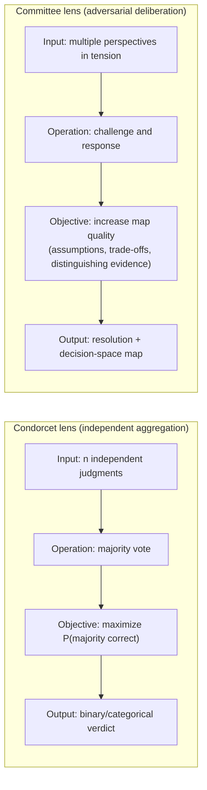
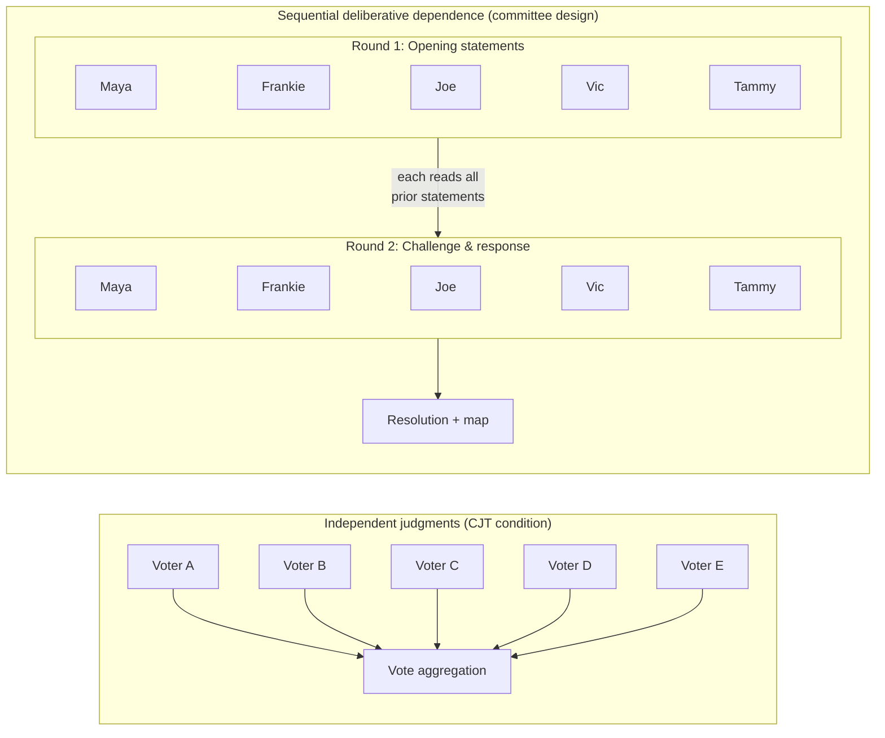
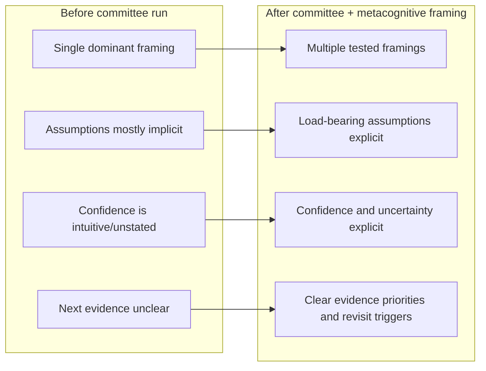

# Condorcet's Jury Theorem and the Committee

This document clarifies the relationship between the Cyberneutics adversarial committee process and **Condorcet's jury theorem** (CJT). It states our design goals first, then introduces CJT as a motivating analogy, lists where our process does *not* satisfy the theorem's conditions, identifies what *does* theoretically ground our design, and states that a CJT-compliant variant would be a different pipeline — not a modification of this one.

**We do not satisfy Condorcet's jury theorem.** Our process is deliberative and dependent by design. This artifact documents that relationship — and points to the theoretical traditions that *do* apply — so users and reviewers are not misled.

---

## 1. Design goals of the committee process

The committee is designed to:

- **Stress-test** a decision or situation by having multiple characters argue from different propensities (political awareness, evidence, continuity, values, systems).
- **Map the decision space** — surface trade-offs, hidden assumptions, and what evidence would distinguish between interpretations.
- **Produce a resolution and decision-space map**, not a single binary vote. The output is a structured record (charter, deliberation transcript, resolution, optional evaluation) that supports the user's judgment rather than replacing it.

The value is in the **adversarial back-and-forth**: characters read each other's arguments and respond. That interaction is essential. We are not aggregating independent judgments; we are generating a map through structured conflict.

---

## 2. Condorcet's jury theorem as motivating analogy

**Condorcet's jury theorem** (Condorcet, 1785) concerns a group that decides by **majority vote** between two options, one of which is correct. Each voter has an **independent** probability *p* of voting for the correct option. The theorem states:

- If *p* > 1/2 (each voter is more likely than not to be right), then adding more voters **increases** the probability that the majority is correct, approaching 1 as the number of voters grows.
- If *p* < 1/2, adding more voters **worsens** the outcome; the "optimal jury" is a single voter.

Extensions allow **heterogeneous competence** (each voter has a possibly different *p*ₑ). Some modern work shows that without strong evidence of competence, the thesis of the theorem does not hold almost surely (e.g. Berend & Paroush, 1998; Romaniega Sancho, 2022 — see references below).

The **intuition** that motivates our use of multiple perspectives is related: many independent, moderately competent perspectives can outperform a single one. That intuition is consistent with CJT when its assumptions hold. Our process, however, **does not implement those assumptions**. We document the analogy so that the intuition is clear, and the gap is explicit.

### Visual 1: Objective mismatch

---

## 3. Where we do not satisfy CJT

Our committee process **deliberately deviates** from the conditions of Condorcet's jury theorem. We do not claim compliance.

| CJT condition | Our process | Implication |
|---------------|-------------|-------------|
| **Independent** judgments | Characters **deliberate together**; they read and respond to each other. Judgments are **dependent**. | We are not aggregating independent votes. Dependence is intentional — it enables stress-testing and refutation. |
| **Binary** correct/incorrect outcome | Output is a **resolution plus decision-space map**, not a single "correct" or "incorrect" choice. The user is the editor; the committee informs, it does not decide. | We are not maximizing the probability of a correct binary vote. We are optimizing for map quality and adversarial rigor. |
| **Literal probability *p* (or *p*ₑ) per voter** | We have **propensities** (e.g. paranoid realism, evidence prosecutor), not competence scores. We do not measure or claim *p* > 1/2 for any character. | Even if we had a vote step, we could not claim CJT applies without evidence of competence; such evidence is not part of our design. |

**Summary:** We are not implementing a jury. We are implementing **adversarial sense-making**: multiple perspectives in tension, with the goal of surfacing what is at stake, not of producing a single "correct" answer by majority rule.

### Visual 2: Dependence as feature

The CJT topology is a **fan** (parallel, independent) into an aggregation node. The committee topology is a **sequential pipeline with feedback** — each round's output becomes the next round's input. Dependence is not a defect; it is the mechanism. For the formal treatment of this topology as resource equations, see [committee-as-palgebra.md](../palgebra/committee-as-palgebra.md).

### Visual 3: User-state delta

---

## 4. What *does* theoretically ground our design

CJT is the wrong theorem for what we do. But "not CJT" does not mean "no theoretical basis." Three bodies of work are closer to the committee's actual mechanism:

### Diversity trumps ability (Hong & Page, 2004)

Hong and Page proved that **groups of diverse problem-solvers outperform groups of high-ability problem-solvers** on complex problems, provided the problem is hard enough and the group is large enough. Critically, their result **does not require independence** — agents interact with a shared problem landscape. What matters is that their heuristics (search strategies) are *different*, not that they are *isolated*.

This is close to what the committee does: five characters with **incompatible propensities** (paranoid realism, evidence prosecution, institutional memory, values advocacy, systems thinking) search the decision space using different heuristics. The value comes from the **diversity of search strategies**, not from independence of error.

### Deliberative democracy (Habermas, 1996; Fishkin, 2009)

The political-theory tradition of deliberative democracy argues that group decisions improve through **structured argumentation under procedural constraints** — not through aggregating pre-formed preferences. Fishkin's empirical work on Deliberative Polling shows that informed, structured deliberation produces better-calibrated preferences than raw aggregation, precisely because participants **update in response to each other's arguments**.

The committee process operationalizes this: Robert's Rules as procedural constraint, structured rounds, challenge-and-response protocol. Dependence (reading and responding to each other) is the source of quality, not a contamination to be avoided.

### Adversarial collaboration (Kahneman & Klein, 2009; Tetlock, 2005)

The practice of adversarial collaboration — where researchers who disagree on a prediction design a joint study to resolve the disagreement — has been shown to produce sharper hypotheses and more actionable experiments than either side working alone. The committee generalizes this: five characters with structurally incompatible commitments are **forced to confront each other's best arguments**, surfacing load-bearing assumptions that lone analysis would leave implicit.

### Where independence *does* apply: the evaluation step

The committee deliberately sacrifices independence during **generation** (deliberation). But the methodology recovers a form of independence at **evaluation**: the [independent evaluation protocol](independent-evaluation.md) passes the transcript to a **fresh model instance** with no conversation history and no knowledge of the generation process. This evaluator judges the output against explicit rubrics without investment in its coherence.

This is structurally analogous to CJT's setup: an independent observer making a judgment without correlated error. The methodology applies the independence principle where it is productive (evaluation of output quality) and uses deliberative dependence where *that* is productive (generation of the decision-space map). The two mechanisms are complementary, not competing.

---

## 5. A CJT-compliant variant would be a different pipeline

A pipeline that *did* aim to satisfy (or approximate) CJT would look different:

- **Independent generation:** Each of *n* "voters" would produce a judgment **without** reading the others' outputs. No deliberation, no cross-reading.
- **Aggregation:** Those judgments would then be combined (e.g. by majority or supermajority) into a single binary or categorical outcome.
- **Competence:** One would need a way to assess or assume *p*ₑ > 1/2 (or similar) for the theorem's conclusion to hold.

That pipeline would be a **different design** — not a "correction" or tweak to the current committee. It would sacrifice deliberation and stress-testing for independence and aggregability. We do not build that variant here; we document it so that:

- Contributors who want to explore a CJT-style design can build it as a separate pipeline and compare it to the deliberative one.
- Users do not assume our committee "satisfies" or "corrects for" Condorcet; we clarify and document the relationship instead.

If evidence later emerges from comparing a deliberative pipeline to an independent-aggregation pipeline, that could inform whether to offer both variants or revisit this document.

### Sketch: a comparison protocol

A fair comparison would hold the question, the model, and the evaluation rubric constant, then vary only the pipeline topology:

1. **Deliberative arm:** Standard committee run — charter, roster, multi-round deliberation, resolution + map, independent evaluation.
2. **Independent-aggregation arm:** Same five characters produce opening statements **in isolation** (no cross-reading). A sixth call aggregates by majority or supermajority into a single verdict. Same independent evaluation.
3. **Shared rubric:** Score both outputs on the five committee rubric dimensions (reasoning completeness, adversarial rigor, assumption surfacing, evidence standards, trade-off explicitness) plus a sixth: **verdict accuracy** where ground truth is available.
4. **Repeat:** Run both arms on the same set of questions (minimum 10–20) to get distributional rather than anecdotal evidence.

The expected trade-off: the independent arm should produce higher agreement when there is a clear "correct" answer (CJT's strength), while the deliberative arm should produce richer maps and better-surfaced assumptions (its design purpose). This is not a competition but a characterization of where each topology performs.

---

## 6. References

### Condorcet and extensions

- **Condorcet, M. de** (1785). *Essai sur l'application de l'analyse à la probabilité des décisions rendues à la pluralité des voix.* (Essay on the application of analysis to the probability of majority decisions.)
- **Berend, D., & Paroush, J.** (1998). When is Condorcet's Jury Theorem valid? *Social Choice and Welfare*, 15(4), 481–488. (Heterogeneous competence.)
- **Romaniega Sancho, Á.** (2022). On the probability of the Condorcet Jury Theorem or the Miracle of Aggregation. *Mathematical Social Sciences*, 119, 41–55. (Prior probability of CJT holding without evidence of competence.)

### Diversity and group problem-solving

- **Hong, L., & Page, S. E.** (2004). Groups of diverse problem solvers can outperform groups of high-ability problem solvers. *Proceedings of the National Academy of Sciences*, 101(46), 16385–16389. (Diversity of heuristics outperforms individual ability on complex problems; does not require independence.)

### Deliberative democracy and adversarial collaboration

- **Habermas, J.** (1996). *Between Facts and Norms: Contributions to a Discourse Theory of Law and Democracy.* MIT Press. (Procedurally constrained argumentation as a source of legitimacy and quality.)
- **Fishkin, J. S.** (2009). *When the People Speak: Deliberative Democracy and Public Consultation.* Oxford University Press. (Empirical evidence that structured deliberation produces better-calibrated group judgments than raw aggregation.)
- **Kahneman, D., & Klein, G.** (2009). Conditions for intuitive expertise: A failure to disagree. *American Psychologist*, 64(6), 515–526. (Adversarial collaboration as method; structured disagreement producing sharper hypotheses.)

For further reading, see the Wikipedia article on [Condorcet's jury theorem](https://en.wikipedia.org/wiki/Condorcet%27s_jury_theorem) and the repository's [references](../references/README.md), [adversarial committees](adversarial-committees.md) artifact, and [independent evaluation](independent-evaluation.md) protocol.

---

## Summary

- **Design first:** The committee is for stress-testing and decision-space mapping, not for aggregating independent votes.
- **CJT as analogy:** The theorem motivates the intuition that multiple perspectives can help; we do not implement its conditions.
- **Deviations:** We do not have independence, binary correct/incorrect, or literal *p*; we document these deviations so our relationship to CJT is clear.
- **Positive grounding:** Hong-Page diversity, deliberative democracy, and adversarial collaboration *do* theoretically support our design — and none of them require independence.
- **Independence where it fits:** The methodology applies independence at evaluation (fresh model instance, no shared context) while using deliberative dependence at generation. The two mechanisms are complementary.
- **Different pipeline:** A CJT-compliant variant would require independent generation and aggregation; that would be a different pipeline, not a correction to this one. A comparison protocol is sketched above for future contributors.

This document clarifies where we stand relative to Condorcet, names the theoretical traditions that *do* apply, and documents the design choices so that users and reviewers can assess both the strengths and the honest limitations of the committee process.
