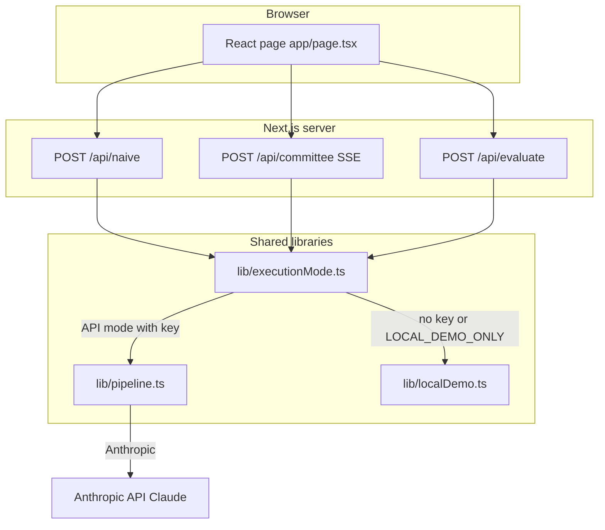

# Cyberneutics interactive demo

This folder is a **local-only** web app. It shows the same question answered two ways:

1. **Naive path** — one model, one shot (a single narrative).
2. **Committee path** — several **adversarial characters** take multiple **rounds**, then an **independent evaluator** scores the result.

That contrast is the heart of [adversarial committees](../artifacts/adversarial-committees.md) in the main repo. If you are new to the ideas, read [Start here](../artifacts/start-here.md) first; this demo is a **hands-on companion**, not a substitute for the methodology write-ups.

**Run mode is part of the contract.** Every metric and chart is computed from whatever this run actually produced: **local** mode uses fixed scripts in `lib/localDemo.ts`, so the same question yields the same transcript, scores, and keyword-derived signals (for example metacognition counts) on every run—batch mode repeats that identical outcome. **API** mode calls Claude, so outputs and scores can vary between runs; batch mode then measures real stochastic variance. Interpreting “stability,” trends, or deltas without checking whether runs were local or API is misleading. Use local to learn the UI and code paths offline; use API when you care about live model behavior.

**Stance:** The repo is here so you can **read** and **run** the work yourself—including this demo. It is **not** set up around an open-contribution or maintainer workflow. If something is unclear or broken while you use the app, feedback is still welcome.

---

## Who this is for

- **Explorers** — You want to *see* multi-perspective deliberation next to a single answer without running slash commands in an agent session.
- **Builders** — You want to trace how requests flow through Next.js API routes and where local vs. remote inference diverges.
- **Facilitators** — You need a short, accurate description to share with others (“what happens when I click Run?”).

**Not covered here:** Hosting this app on the public internet, API keys on a shared server, or production hardening. Treat it as **your laptop + your Anthropic account**.

---

## Table of contents

- [Requirements](#requirements)
- [Quick start](#quick-start)
- [What you see in the browser](#what-you-see-in-the-browser)
- [Concept glossary](#concept-glossary)
- [How it works (overview)](#how-it-works-overview)
- [How it works (detail)](#how-it-works-detail)
  - [Execution modes](#execution-modes)
  - [Naive path](#naive-path)
  - [Committee path](#committee-path)
  - [Evaluation](#evaluation)
  - [Data the app keeps on your machine](#data-the-app-keeps-on-your-machine)
- [Environment variables](#environment-variables)
- [Scripts](#scripts)
- [Project layout (where to read code)](#project-layout-where-to-read-code)
- [Troubleshooting](#troubleshooting)
- [Documentation and UI accessibility](#documentation-and-ui-accessibility)
- [Learn more](#learn-more)

---

## Requirements

- **Node.js 20+** (LTS recommended)
- **npm** 10+ (or `pnpm` / `yarn` with equivalent commands)

---

## Quick start

From the **repository root**:

```bash
cd demo
npm install
npm run setup
npm run dev
```

Open [http://localhost:3000](http://localhost:3000).

- **`npm run setup`** creates `demo/.env.local` from `.env.example` if it does not exist. Skip if you already use `.env.local`.
- **No API key:** The app still runs. “Auto” execution uses **deterministic local text** (no network calls to Anthropic).
- **With API key:** Add `ANTHROPIC_API_KEY` to `.env.local` and restart the dev server for **live** Claude calls.
- **Prefer the terminal?** Run `npm run tour` for a guided walkthrough of each pipeline stage with pointers to the files you would modify to extend the system. See [Scripts](#scripts) for options.

---

## What you see in the browser

| Area | Purpose |
|------|--------|
| **Question** | Your prompt (or a preset). This is sent to both paths. |
| **Naive panel** | Streaming answer from the single-call path. |
| **Committee panel** | Multiple **characters** (Maya, Frankie, Joe, Vic, Tammy — see `lib/characters.ts`) speaking in **phases** / rounds. |
| **Evaluation** | A structured scorecard (rubrics) comparing quality signals; run separately for naive vs. committee outputs. |
| **Extras** | Metrics, accountability / disposition UI, run history — all optional depth for comparing runs on the same question. |

The UI may offer **local vs. API** run mode where supported. **“Local”** here means *deterministic demo text or heuristic scoring in this repo*, not “offline Claude.”

**In the app:** use **About this demo** (top right) for the same overview and a short glossary without leaving the browser.

---

## Concept glossary

Short definitions for reading the UI and the code. (The in-app **About this demo** dialog mirrors this list.)

| Term | Meaning |
|------|--------|
| **Adversarial committee** | Several model-backed **characters** with different lenses answer the same question in **rounds**, so disagreement and blind spots surface before any single narrative wins. |
| **Naive path** | One completion from one system prompt on your question—the baseline “single voice” answer the committee is compared against. |
| **Phase / round** | A committee stage (e.g. first responses, cross-examination, follow-ups). Local demo uses **scripted** text; API mode runs the full pipeline in `lib/pipeline.ts`. |
| **Character / roster** | Fixed personas (Maya, Frankie, Joe, Vic, Tammy), each with a **system prompt** in `lib/characters.ts`. |
| **Research (API only)** | Before round one, each character can run a **research** step (`lib/research.ts`). Local demo **skips** this and uses canned round-one lines. |
| **Server-Sent Events (SSE)** | HTTP streaming format for **`POST /api/committee`**: the server pushes **events** (phase, character chunks, done) so text appears incrementally. |
| **Execution mode** | The UI exposes **`local`** and **`api`**: whether a run uses in-repo demo logic or **Anthropic** (`lib/executionMode.ts`). The route layer also accepts **`auto`** for programmatic callers. This choice determines whether repeated runs and batch mode show **identical** outputs (local) or **variable** ones (API)—always note which mode produced the history you are reading. |
| **Local demo** | Deterministic transcripts and evaluation-shaped JSON in **`lib/localDemo.ts`**—no API key required for UI local mode or route-level `auto` fallback. Same inputs ⇒ same metrics every time. |
| **Evaluator / rubric** | Structured scores on a transcript (**`EvaluationResult`** in `lib/types.ts`). **`POST /api/evaluate`** returns either heuristic local scores or model-produced JSON. |
| **Run mode (UI)** | Label in the UI for choosing local vs API **inference**; must agree with env (key present) for real API calls. |

---

## How it works (overview)



- The **browser** never holds your API key. Keys live in **server-side** env (`demo/.env.local`) read by **route handlers**.
- **Committee** updates stream over **Server-Sent Events** (`text/event-stream`) from `/api/committee` so you see partial text as it is generated.

---

## How it works (detail)

### Execution modes

`lib/executionMode.ts` decides whether a route uses **local demo** logic or **Anthropic**:

| Mode | Behavior |
|------|----------|
| **`auto`** (route-level fallback) | If `ANTHROPIC_API_KEY` is missing **or** `LOCAL_DEMO_ONLY=1`, use local demo. Otherwise use the API. |
| **`local`** | Always local demo (no Anthropic), even if a key is set. |
| **`api`** | Requires `ANTHROPIC_API_KEY`; throws if missing. |

So: **clone with no key → everything still works** using canned text and heuristic evaluation structures.

### Naive path

- **Route:** `POST /api/naive` (`app/api/naive/route.ts`).
- **Local:** `buildLocalNaiveAnswer` in `lib/localDemo.ts` returns fixed template paragraphs (mentions your question).
- **API:** Streams one Claude completion with the naive system prompt (`lib/prompts.ts`).

### Committee path

- **Route:** `POST /api/committee` (`app/api/committee/route.ts`) — **SSE** stream of typed events (phase start, character chunks, research, done).
- **Core orchestration:** `runCommitteePipeline` in `lib/pipeline.ts`.

**Local committee (no API):**

1. **Phase 1** — For each character, emit **scripted** round-one text from `buildLocalCommitteeRound1`.
2. **Phase 2** — Scripted round-two from `buildLocalCommitteeRound2`.
3. **Phases 3+** (if you configured more rounds) — Synthetic “refinement” text using vote inference on prior text, still deterministic.

**API committee (with key):**

1. **Research** — Each character runs a **research** step (`lib/research.ts`) in parallel; results feed round one.
2. **Phase 1** — Each character gets a **round-one** user prompt that includes rendered research (`buildRoundOnePromptWithResearch`).
3. **Phase 2** — **Cross-examination** style prompt; each character sees others’ round-one answers (`buildCrossExaminationPrompt` + shared transcript).
4. **Phases 3–N** — **Follow-up deliberation** rounds (`buildFollowupDeliberationPrompt`) up to the configured cap (pipeline clamps rounds **between 2 and 6**).

Model id used for API calls is set in the route/pipeline code (currently **Claude Sonnet** family — see `MODEL` in `lib/pipeline.ts` and `app/api/naive/route.ts`).

### Evaluation

- **Route:** `POST /api/evaluate` (`app/api/evaluate/route.ts`).
- **Input:** Original question, full transcript, and whether the transcript is `naive` or `committee`.
- **Local:** `buildLocalEvaluation` returns a **fixed-shape** JSON object matching the evaluator rubric types (`lib/localDemo.ts`).
- **API:** One non-streaming Claude call with `EVALUATOR_PROMPT`; the model must return **JSON** parsed into `EvaluationResult`.

So the **same rubric dimensions** are shown in the UI for both paths; only the *source* of the numbers (heuristic vs. model) changes.

### Data the app keeps on your machine

The UI stores **run history** and **decision accountability** records in **`localStorage`** (browser), under keys defined in `lib/runMemory.ts` and `lib/decisionMemory.ts`. Nothing is sent to a Cyberneutics server — there isn’t one. Clearing site data for `localhost` resets that state.

---

## Environment variables

| Variable | Meaning |
|----------|---------|
| `ANTHROPIC_API_KEY` | Optional. If set and mode allows API, routes call Anthropic. |
| `LOCAL_DEMO_ONLY` | If `1`, forces **local demo** even when a key is present. |
| `NEXT_PUBLIC_REPO_URL` | Optional. Git repo root URL (no trailing slash) for **GitHub** and **About** links. Defaults to upstream; set to your **fork** when you maintain one. |
| `NEXT_PUBLIC_REPO_BRANCH` | Optional. Branch for `/blob/...` links (default **`main`**). |

Copy from `.env.example` or run `npm run setup`.

**Security:** Never commit `.env.local` or paste keys into issues, chats, or screenshots. Rotate keys in the [Anthropic console](https://console.anthropic.com/) if exposed.

---

## Scripts

| Command | Description |
|---------|-------------|
| `npm run setup` | Create `.env.local` from `.env.example` when missing |
| `npm run dev` | Development server (Turbopack) |
| `npm run build` | Production build |
| `npm run start` | Serve production build (run `build` first) |
| `npm run lint` | ESLint |
| `npm test` | Vitest unit tests |
| `npm run tour` | CLI pipeline tour: runs each stage in the terminal with extension pointers |
| `npm run tour -- --live` | Same tour using live Anthropic API (requires `ANTHROPIC_API_KEY`) |
| `npm run tour -- --step <name>` | Run one section only: `roster`, `naive`, `committee`, `evaluate`, or `extend` |

**Production-style local run:**

```bash
npm run build
npm run start
```

Default port is **3000**. If it is busy, use e.g. `npx next dev -p 3001` / `npx next start -p 3001`.

---

## Project layout (where to read code)

| Path | Role |
|------|------|
| `app/page.tsx` | Main UI and client-side orchestration |
| `app/api/*/route.ts` | Naive, committee (SSE), evaluate |
| `lib/pipeline.ts` | Committee phase machine (local + API) |
| `lib/localDemo.ts` | Deterministic transcripts and local evaluation |
| `lib/executionMode.ts` | Local vs. API gate |
| `lib/repoUrls.ts` | `NEXT_PUBLIC_REPO_URL` / branch for GitHub links in the UI |
| `lib/prompts.ts` | System and user prompts |
| `lib/characters.ts` | Roster + per-character system prompts |
| `components/` | Panels, dashboards, inputs |

Formal pipeline algebra for committees (resource view): [Committee as Palgebra](../palgebra/committee-as-palgebra.md).

---

## Troubleshooting

- **API errors / “missing key”:** Put `ANTHROPIC_API_KEY` in `demo/.env.local`, restart `npm run dev`. For forced offline demo, set `LOCAL_DEMO_ONLY=1`.
- **Install or build failures:** Use Node 20+; delete `node_modules` and run `npm install` again in `demo/`.
- **Stale UI state:** Clear `localhost` storage or use the app’s clear actions if provided.
- **Port conflicts:** Use `-p` as above.

---

## Documentation and UI accessibility

- **This README** is written for clarity first: [concept glossary](#concept-glossary), tables, and a diagram so you can skim or drill down.
- **About this demo** in the UI opens a native `<dialog>` with the overview and glossary; keyboard **Escape** closes it (browser default). **Close** returns focus to the page.
- **The web UI** is a developer demo: some panels are visually dense. If you need **keyboard-only** or **screen-reader** polish for a public deployment, plan a dedicated pass (focus order, `aria-live` on streaming regions, reduced-motion). For local experimentation, the priority is understanding the **method** and the **code path**.

---

## Learn more

- [Next.js documentation](https://nextjs.org/docs)
- Repository overview: [README.md](../README.md)
- Run / test / CI (including this demo): [Repository review and run guide](../meta/repository-review-and-run-guide.md)
